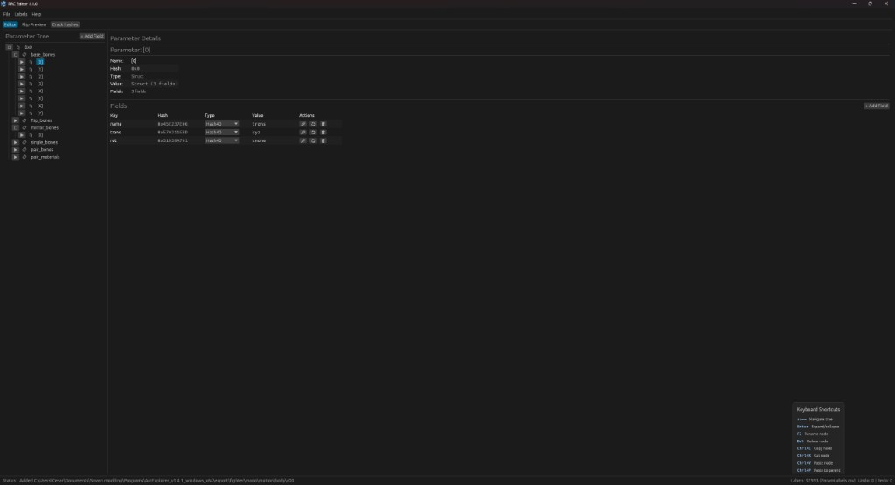
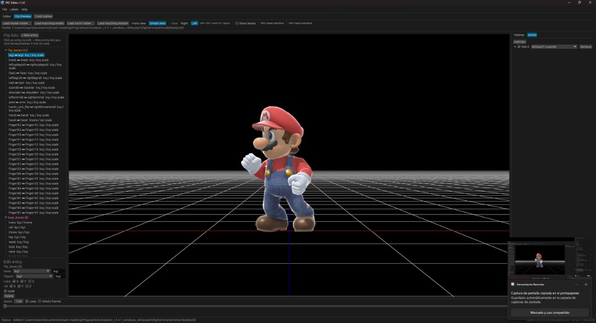

# PRC Editor (Rust)

A Windows desktop editor for Smash Ultimate parameter files (`.prc`, `.prcx`, `.stdat`, and related formats), written in Rust with [egui](https://github.com/emilk/egui).



Browse the parameter tree on the left, edit fields on the right, and switch to **Flip Preview** to see how `flip.prc` mappings look on a loaded fighter. **Help > Check for Updates** downloads a new `Prc-Editor.exe` next to the current program, the same way [SSBH Editor](https://github.com/CrusherD2/ssbh_editor) does.

## Features

- Tree navigation of parameter structs and lists
- Field table with Hash40 autocomplete from `ParamLabels.csv`
- Checkbox editing for boolean fields
- Label editor with search and pagination
- Add child items to the selected category (for example a new entry under `flip_bones`)
- Undo / redo, copy / paste, and in-place save
- **Labels** downloads [ParamLabels.csv](https://github.com/CrusherD2/param-labels) into `%AppData%\Roaming\Smash Ultimate Labels` and keeps newly cracked names in that file
- **Crack hashes** tests ParamLabels, names from the loaded model, and short brute-force against unresolved `0x` hashes
- **Help > Check for Updates** looks up the latest GitHub release and can save the new exe beside this one

### Flip Preview



Open a `flip.prc` (or any param file with flip lists), load the fighter’s model and motion folders, and preview the stance in the viewport:

- Smash camera views, including **Left**, which applies the in-game 180° turn, rotation flags, translation flip, and `flip_bones`
- Flip list sidebar for `flip_bones`, `base_bones`, mesh pairs, Have bones, and materials, with per-axis trans / rot / scale flags
- Mesh visibility and animation slots with a play/pause timeline (Speed, Loop, Whole frames)
- Load matching model / motion from the open param file’s fighter path

## Download

Grab the Windows executable from [Releases](https://github.com/CrusherD2/prc-editor-rust/releases).

ParamLabels.csv is downloaded automatically on first run. Use **Labels > Download** to refresh it, or **Help > Check for Updates** when a newer editor build is available.

## Build from source

Requires a recent Rust toolchain.

```bash
git clone https://github.com/CrusherD2/prc-editor-rust.git
cd prc-editor-rust
cargo build --release
```

The binary is written to `target/release/Prc-Editor.exe`.

## Usage

1. Load `ParamLabels.csv` when prompted (or from the Labels menu). The editor can also download it for you.
2. Open a `.prc` / `.prcx` / `.stdat` file from **File > Open**.
3. Browse the parameter tree on the left and edit fields on the right.
4. Use **Flip Preview** to load a model and motion folder and check left/right facing.
5. Use **Help > Check for Updates** to download a newer `Prc-Editor.exe` next to the current one.

## Credits

This project is a Rust rewrite that **heavily uses the original PRC editor** as its reference for file format, UI layout, and editing workflow.

- Original library and **prcEditor**: [BenHall-7/paracobNET](https://github.com/BenHall-7/paracobNET) by Benjamin Hall
- Parameter labels: [CrusherD2/param-labels](https://github.com/CrusherD2/param-labels) (fork of [ultimate-research/param-labels](https://github.com/ultimate-research/param-labels))
- Flip Preview rendering uses [ssbh_wgpu](https://github.com/ScanMountGoat/ssbh_wgpu) from SSBH Editor
- This Rust version was built with the use of AI (Cursor)

The original `prcEditor` is the Windows C# TreeView / DataGrid tool this version is based on. Hash40 parsing, label handling, and most of the editor behavior were modeled directly after that project. This repo would not exist without that work.

## License

MIT, same as [paracobNET](https://github.com/BenHall-7/paracobNET). See [LICENSE](LICENSE).
